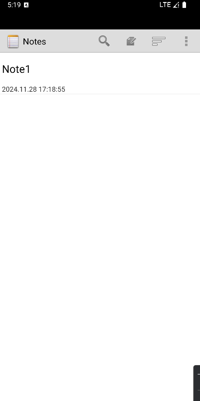

# NotePad功能拓展


## 1.基础功能：NoteList界面中笔记条目增加时间戳显示

在原来的NotePad应用中笔记只显示了标题，我们对他进行增加时间戳显示拓展，我们可以把时间显示在每条笔记的标题的下方。

首先我们找到布局文件noteslist_item.xml

在这个布局文件中有一个TextView,就是笔记的标题

```xml
<TextView xmlns:android="http://schemas.android.com/apk/res/android"
    android:id="@android:id/text1"
    android:layout_width="match_parent"
    android:layout_height="?android:attr/listPreferredItemHeight"
    android:textAppearance="?android:attr/textAppearanceLarge"
    android:gravity="center_vertical"
    android:paddingLeft="5dip"
    android:singleLine="true"
    />
```

我们要在标题的下方添加一个时间戳，则我们需要创建一个新的TextView，并且把布局改成线性的垂直布局，这样才能使得时间戳在标题的下方。添加后的代码如下

```xml
<?xml version="1.0" encoding="utf-8"?>
<LinearLayout
    xmlns:android="http://schemas.android.com/apk/res/android"
    android:layout_width="match_parent"
    android:layout_height="wrap_content"
    android:orientation="vertical"
    >

    <TextView xmlns:android="http://schemas.android.com/apk/res/android"
        android:id="@android:id/text1"
        android:layout_width="match_parent"
        android:layout_height="?android:attr/listPreferredItemHeight"
        android:textAppearance="?android:attr/textAppearanceLarge"
        android:gravity="center_vertical"
        android:paddingLeft="5dip"
        android:singleLine="true"
        />
    
    <TextView
        android:id="@+id/text1_time"
        android:layout_width="match_parent"
        android:layout_height="wrap_content"
        android:textAppearance="?android:attr/textAppearanceSmall"
        android:text="Title:"
        android:paddingLeft="5dip"
        />

</LinearLayout>
```

接着我们在NotePadProvider.java中查看数据库结构：

```java
@Override
public void onCreate(SQLiteDatabase db) {
    db.execSQL("CREATE TABLE " + NotePad.Notes.TABLE_NAME + "   ("
            + NotePad.Notes._ID + " INTEGER PRIMARY KEY,"
            + NotePad.Notes.COLUMN_NAME_TITLE + " TEXT,"
            + NotePad.Notes.COLUMN_NAME_NOTE + " TEXT,"
            + NotePad.Notes.COLUMN_NAME_CREATE_DATE + " INTEGER,"
            + NotePad.Notes.COLUMN_NAME_MODIFICATION_DATE + " INTEGER,"
            + ");");
}
```

再到NoteList.java文件中查看，是如何将数据装填到列表中。用到的数据被定义**在PROJECTION**中,我们使用修改时间作为显示的时间：

```java
private static final String[] PROJECTION = new String[] {
        NotePad.Notes._ID, // 0
        NotePad.Notes.COLUMN_NAME_TITLE, // 1
        NotePad.Notes.COLUMN_NAME_MODIFICATION_DATE,//修改时间
};
```

通过**Cursor**从数据库中读取出：

```java
Cursor cursor = managedQuery(
    getIntent().getData(),            // Use the default content URI for the provider.
    PROJECTION,                       // Return the note ID and title for each note.
    null,                             // No where clause, return all records.
    null,                             // No where clause, therefore no where column values.
    NotePad.Notes.DEFAULT_SORT_ORDER  // Use the default sort order.
);
```

通过**SimpleCursorAdapter**装填：

```java
// The names of the cursor columns to display in the view, initialized to the title column
String[] dataColumns = { NotePad.Notes.COLUMN_NAME_TITLE, NotePad.Notes.COLUMN_NAME_MODIFICATION_DATE} ;

// The view IDs that will display the cursor columns, initialized to the TextView in
// noteslist_item.xml
int[] viewIDs = { android.R.id.text1,R.id.text1_time };

// Creates the backing adapter for the ListView.
SimpleCursorAdapter adapter
    = new SimpleCursorAdapter(
              this,                             // The Context for the ListView
              R.layout.noteslist_item,          // Points to the XML for a list item
              cursor,                           // The cursor to get items from
              dataColumns,
              viewIDs
      );

// Sets the ListView's adapter to be the cursor adapter that was just created.
setListAdapter(adapter);
```

在dataColumns，viewIDs中补充时间部分：

```java
// The names of the cursor columns to display in the view, initialized to the title column
String[] dataColumns = { NotePad.Notes.COLUMN_NAME_TITLE, NotePad.Notes.COLUMN_NAME_MODIFICATION_DATE} ;

// The view IDs that will display the cursor columns, initialized to the TextView in
// noteslist_item.xml
int[] viewIDs = { android.R.id.text1,R.id.text1_time };
```

此时插入的是时间戳而不是时间格式，我们需要进行转换，我们在**NotePadProvider中的insert方法**和**NoteEditor中的updateNote**方法插入时间转换的代码。前者为创建笔记时产生的时间，后者为修改笔记时产生的时间。

```java
Long now = Long.valueOf(System.currentTimeMillis());
Date date = new Date(now);
SimpleDateFormat format = new SimpleDateFormat("yyyy.MM.dd HH:mm:ss");
String dateTime = format.format(date);
```

运行效果：



再添加一条笔记：


修改第一条笔记：


## 2.基础功能：添加笔记查询功能

我们需要再应用中添加一个搜索的按钮，点击搜索按钮会弹出一个搜索框，我们可以在搜索框中输入内容从而达到笔记查询功能。

首先我们在菜单的xml文件中的list_options_menu.xml，添加一个搜索的按钮

```xml
<item
    android:id="@+id/menu_search"
    android:title="@string/menu_search"
    android:icon="@android:drawable/ic_search_category_default"
    android:showAsAction="always">
</item>
```

在NoteList中找到onOptionsItemSelected方法，在switch中添加搜索的case语句:

```xml
case R.id.menu_search:
    Intent intent = new Intent();
    intent.setClass(NotesList.this,NoteSearch.class);
    NotesList.this.startActivity(intent);
    return true;
```

在layout中新建布局文件note_search_list.xml：

```xml
<?xml version="1.0" encoding="utf-8"?>
<LinearLayout xmlns:android="http://schemas.android.com/apk/res/android"
    android:orientation="vertical" android:layout_width="match_parent"
    android:layout_height="match_parent">
    <SearchView
        android:id="@+id/search_view"
        android:layout_width="match_parent"
        android:layout_height="wrap_content"
        android:iconifiedByDefault="false"
        android:queryHint="输入搜索内容..."
        android:layout_alignParentTop="true">
    </SearchView>
    <ListView
        android:id="@android:id/list"
        android:layout_width="match_parent"
        android:layout_height="wrap_content">
    </ListView>
</LinearLayout>
```

要动态地显示搜索结果，就要对SearchView文本变化设置监听，NoteSearch除了要继承ListView外还要实现SearchView.OnQueryTextListener接口：

```java
package com.example.android.notepad;

import android.app.ListActivity;
import android.content.ContentUris;
import android.content.Intent;
import android.database.Cursor;
import android.net.Uri;
import android.os.Bundle;
import android.view.View;
import android.widget.ListView;
import android.widget.SearchView;

public class NoteSearch extends ListActivity implements SearchView.OnQueryTextListener {
    private static final String[] PROJECTION = new String[] {
            NotePad.Notes._ID, // 0
            NotePad.Notes.COLUMN_NAME_TITLE, // 1
            //扩展 显示时间 颜色
            NotePad.Notes.COLUMN_NAME_MODIFICATION_DATE, // 2
    };
    @Override
    protected void onCreate(Bundle savedInstanceState) {
        super.onCreate(savedInstanceState);
        setContentView(R.layout.note_search_list);
        Intent intent = getIntent();
        if (intent.getData() == null) {
            intent.setData(NotePad.Notes.CONTENT_URI);
        }
        SearchView searchview = (SearchView)findViewById(R.id.search_view);
        //为查询文本框注册监听器
        searchview.setOnQueryTextListener(NoteSearch.this);
    }
    @Override
    public boolean onQueryTextSubmit(String query) {
        return false;
    }
    @Override
    public boolean onQueryTextChange(String newText) {
        SearchView searchview = (SearchView)findViewById(R.id.search_view);
        searchview.setOnQueryTextListener(NoteSearch.this);
        String selection = NotePad.Notes.COLUMN_NAME_TITLE + " Like ? ";
        String[] selectionArgs = { "%"+newText+"%" };
        Cursor cursor = managedQuery(
                getIntent().getData(),            // Use the default content URI for the provider.
                PROJECTION,                       // Return the note ID and title for each note. and modifcation date
                selection,                        // 条件左边
                selectionArgs,                    // 条件右边
                NotePad.Notes.DEFAULT_SORT_ORDER  // Use the default sort order.
        );
        String[] dataColumns = { NotePad.Notes.COLUMN_NAME_TITLE ,  NotePad.Notes.COLUMN_NAME_MODIFICATION_DATE };
        int[] viewIDs = { android.R.id.text1 , R.id.text1_time };
        MyCursorAdapter adapter = new MyCursorAdapter(
                this,
                R.layout.noteslist_item,
                cursor,
                dataColumns,
                viewIDs
        );
        setListAdapter(adapter);
        return true;
    }
    @Override
    protected void onListItemClick(ListView l, View v, int position, long id) {
        // Constructs a new URI from the incoming URI and the row ID
        Uri uri = ContentUris.withAppendedId(getIntent().getData(), id);
        // Gets the action from the incoming Intent
        String action = getIntent().getAction();
        // Handles requests for note data
        if (Intent.ACTION_PICK.equals(action) || Intent.ACTION_GET_CONTENT.equals(action)) {
            // Sets the result to return to the component that called this Activity. The
            // result contains the new URI
            setResult(RESULT_OK, new Intent().setData(uri));
        } else {
            // Sends out an Intent to start an Activity that can handle ACTION_EDIT. The
            // Intent's data is the note ID URI. The effect is to call NoteEdit.
            startActivity(new Intent(Intent.ACTION_EDIT, uri));
        }
    }
}
```

最后要在AndroidManifest.xml注册NoteSearch：

```xml
<!--添加搜索activity-->
<activity
    android:name="NoteSearch">
</activity>
```

点击搜索按钮：


输入相关词Note1:


ps:给NoteList换个主题，把黑色换成白色，在AndroidManifest.xml中NotesList的Activity中添加：

`android:theme="@android:style/Theme.Holo.Light"`


## 3.拓展功能：导出笔记

先在菜单文件中添加一个导出笔记的选项，editor_options_menu.xml：

```xml
<item android:id="@+id/menu_output"
    android:title="@string/menu_output" />
```

在NoteEditor中找到onOptionsItemSelected()方法，在菜单的switch中添加：

```java
case R.id.menu_output:
     outputNote();
     break;
```

在NoteEditor中添加函数outputNote()：

```java
//跳转导出笔记的activity，将uri信息传到新的activity
private final void outputNote() {
    Intent intent = new Intent(null,mUri);
    intent.setClass(NoteEditor.this,OutputText.class);
    NoteEditor.this.startActivity(intent);
}
```

新建布局output_text.xml，垂直线性布局放置EditText和Button

```xml
<?xml version="1.0" encoding="utf-8"?>
<LinearLayout xmlns:android="http://schemas.android.com/apk/res/android"
    android:layout_width="wrap_content"
    android:layout_height="wrap_content"
    android:orientation="vertical"
    android:paddingLeft="6dip"
    android:paddingRight="6dip"
    android:paddingBottom="3dip">
    <EditText android:id="@+id/output_name"
        android:maxLines="1"
        android:layout_marginTop="2dp"
        android:layout_marginBottom="15dp"
        android:layout_width="wrap_content"
        android:ems="25"
        android:layout_height="wrap_content"
        android:autoText="true"
        android:capitalize="sentences"
        android:scrollHorizontally="true" />
    <Button android:id="@+id/output_ok"
        android:layout_width="wrap_content"
        android:layout_height="wrap_content"
        android:layout_gravity="right"
        android:text="@string/output_ok"
        android:onClick="OutputOk" />
</LinearLayout>
```

创建OutputText的Acitvity:

```java
package com.example.android.notepad;

import android.app.Activity;
import android.database.Cursor;
import android.net.Uri;
import android.os.Bundle;
import android.os.Environment;
import android.view.View;
import android.widget.EditText;
import android.widget.Toast;

import java.io.File;
import java.io.FileOutputStream;
import java.io.OutputStreamWriter;
import java.io.PrintWriter;

public class OutputText extends Activity {
    //要使用的数据库中笔记的信息
    private static final String[] PROJECTION = new String[] {
            NotePad.Notes._ID, // 0
            NotePad.Notes.COLUMN_NAME_TITLE, // 1
            NotePad.Notes.COLUMN_NAME_NOTE, // 2
            NotePad.Notes.COLUMN_NAME_CREATE_DATE, // 3
            NotePad.Notes.COLUMN_NAME_MODIFICATION_DATE, // 4
    };
    //读取出的值放入这些变量
    private String TITLE;
    private String NOTE;
    private String CREATE_DATE;
    private String MODIFICATION_DATE;
    //读取该笔记信息
    private Cursor mCursor;
    //导出文件的名字
    private EditText mName;
    //NoteEditor传入的uri，用于从数据库查出该笔记
    private Uri mUri;
    //关于返回与保存按钮的一个特殊标记，返回的话不执行导出，点击按钮才导出
    private boolean flag = false;
    private static final int COLUMN_INDEX_TITLE = 1;
    public void onCreate(Bundle savedInstanceState) {
        super.onCreate(savedInstanceState);
        setContentView(R.layout.output_text);
        mUri = getIntent().getData();
        mCursor = managedQuery(
                mUri,        // The URI for the note that is to be retrieved.
                PROJECTION,  // The columns to retrieve
                null,        // No selection criteria are used, so no where columns are needed.
                null,        // No where columns are used, so no where values are needed.
                null         // No sort order is needed.
        );
        mName = (EditText) findViewById(R.id.output_name);
    }
    @Override
    public void onResume(){
        super.onResume();
        if (mCursor != null) {
            // The Cursor was just retrieved, so its index is set to one record *before* the first
            // record retrieved. This moves it to the first record.
            mCursor.moveToFirst();
            //编辑框默认的文件名为标题，可自行更改
            mName.setText(mCursor.getString(COLUMN_INDEX_TITLE));
        }
    }
    @Override
    protected void onPause() {
        super.onPause();
        if (mCursor != null) {
            //从mCursor读取对应值
            TITLE = mCursor.getString(mCursor.getColumnIndex(NotePad.Notes.COLUMN_NAME_TITLE));
            NOTE = mCursor.getString(mCursor.getColumnIndex(NotePad.Notes.COLUMN_NAME_NOTE));
            CREATE_DATE = mCursor.getString(mCursor.getColumnIndex(NotePad.Notes.COLUMN_NAME_CREATE_DATE));
            MODIFICATION_DATE = mCursor.getString(mCursor.getColumnIndex(NotePad.Notes.COLUMN_NAME_MODIFICATION_DATE));
            //flag在点击导出按钮时会设置为true，执行写文件
            if (flag == true) {
                write();
            }
            flag = false;
        }
    }
    public void OutputOk(View v){
        flag = true;
        finish();
    }
    private void write()
    {
        try
        {
            // 如果手机插入了SD卡，而且应用程序具有访问SD的权限
            if (Environment.getExternalStorageState().equals(
                    Environment.MEDIA_MOUNTED)) {
                // 获取SD卡的目录
                File sdCardDir = Environment.getExternalStorageDirectory();
                //创建文件目录
                File targetFile = new File(sdCardDir.getCanonicalPath() + "/" + mName.getText() + ".txt");
                //写文件
                PrintWriter ps = new PrintWriter(new OutputStreamWriter(new FileOutputStream(targetFile), "UTF-8"));
                ps.println(TITLE);
                ps.println(NOTE);
                ps.println("创建时间：" + CREATE_DATE);
                ps.println("最后一次修改时间：" + MODIFICATION_DATE);
                ps.close();
                Toast.makeText(this, "保存成功,保存位置：" + sdCardDir.getCanonicalPath() + "/" + mName.getText() + ".txt", Toast.LENGTH_LONG).show();
            }
        }
        catch (Exception e)
        {
            e.printStackTrace();
        }
    }
}
```

在AndroidManifest.xml中将这个Acitvity主题定义为对话框样式，并且加入权限：

```xml
<!--添加导出activity-->
<activity android:name="OutputText"
    android:label="@string/output_name"
    android:theme="@android:style/Theme.Holo.Dialog"
    android:windowSoftInputMode="stateVisible">
</activity>
```

```xml
<!-- 在SD卡中创建与删除文件权限 -->
<uses-permission android:name="android.permission.MOUNT_UNMOUNT_FILESYSTEMS"
    tools:ignore="ProtectedPermissions" />
<!-- 向SD卡写入数据权限 -->
<uses-permission android:name="android.permission.WRITE_EXTERNAL_STORAGE"/>
```

点击笔记，进入到编辑页面，点击右上角导出按钮：


编辑导出的名字：


点击导出：


## 4.拓展功能：笔记排序

在菜单文件list_options_menu.xml中添加：

```xml
<item
    android:id="@+id/menu_sort"
    android:title="menu_sort"
    android:icon="@android:drawable/ic_menu_sort_by_size"
    android:showAsAction="always" >
    <menu>
        <item
            android:id="@+id/menu_sort1"
            android:title="@string/menu_sort1"/>
        <item
            android:id="@+id/menu_sort2"
            android:title="@string/menu_sort2"/>
    </menu>
</item>
```

在NoteList菜单switch下添加case：

```java
//创建时间排序
case R.id.menu_sort1:
    cursor = managedQuery(
            getIntent().getData(),
            PROJECTION,
            null,
            null,
            NotePad.Notes._ID
    );
    adapter = new MyCursorAdapter(
            this,
            R.layout.noteslist_item,
            cursor,
            dataColumns,
            viewIDs
    );
    setListAdapter(adapter);
    return true;
//修改时间排序
case R.id.menu_sort2:
    cursor = managedQuery(
            getIntent().getData(),
            PROJECTION,
            null,
            null,
            NotePad.Notes.DEFAULT_SORT_ORDER
    );
    adapter = new MyCursorAdapter(
            this,
            R.layout.noteslist_item,
            cursor,
            dataColumns,
            viewIDs
    );
    setListAdapter(adapter);
    return true;
```

将adapter,cursor,dataColumns,viewIDs定义在函数外类内：

```java
private MyCursorAdapter adapter;
private Cursor cursor;
private String[] dataColumns = { NotePad.Notes.COLUMN_NAME_TITLE ,  NotePad.Notes.COLUMN_NAME_MODIFICATION_DATE } ;
private int[] viewIDs = { android.R.id.text1 , R.id.text1_time };
```

这是未排序的页面：


点击右上角的排序按钮：


我们修改一下Note3:


修改后：


点击按创建时间排序：


点击按修改时间排序：


